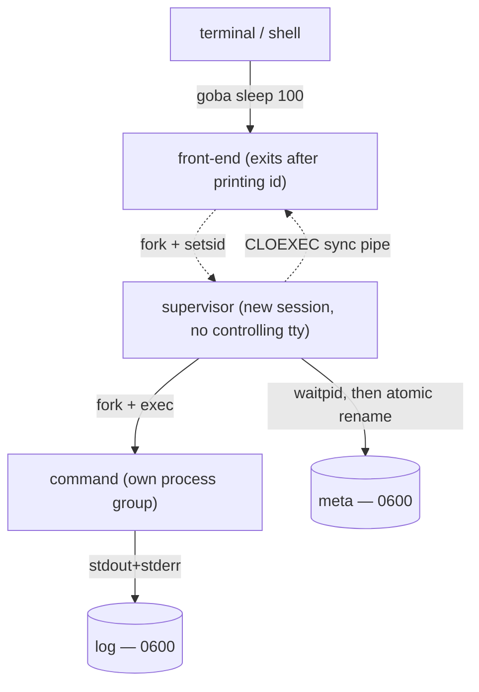

# goba — Requirements

`goba` ("go background") is a single-binary CLI that starts an arbitrary command detached from the
terminal, keeps it running, captures its output to a durable log, and exposes a tiny, stateless
management surface over that log (`view`, `follow`, `kill`, `list`, `remove`).

Status: **v1 scope agreed** (see §16). `MUST`/`SHOULD`/`MAY` per RFC 2119. Sections marked
*[NOTE]* are non-normative implementation notes. Requirements are R1–R70 plus R7b/R7c; acceptance
criteria are A1–A22 (§17). §13.1 records the measured budgets.

---

## 1. One-line contract

> `goba <any command>` detaches the command, returns immediately with an id, and never loses the
> command's output or exit status until the machine reboots.

---

## 2. Non-goals

These are explicitly out of scope for v1. Re-adding them later MUST NOT require changing the
on-disk format or the process model.

- **Not a terminal multiplexer.** No attach, no detach/reattach, no terminal passthrough.
  (cf. `abduco`, `dtach`, `dvtm`, `tmux`, `screen`.)
- **Not an interactive stdin path.** The command's stdin is `/dev/null` in v1.
- **Not a service manager.** No restart policies, no dependencies, no health checks, no backoff.
  (cf. `systemd --user`, `launchd`, `supervisord`.)
- **Not durable across reboot.** Retention is deliberately reboot-scoped (§7.3).
- **Not a scheduler.** (cf. `cron`, `at`, `systemd timers`.)
- **Not multi-user / not privileged.** Per-user only; no setuid, no root state directory.
- **Not Windows in v1.** The platform layer MUST be isolated so it can be added (§12).

---

## 3. Prior art and the gap

| Tool | Why not it |
|---|---|
| `abduco` / `dtach` | Pty-based interactive multiplexers; unmaintained; no log history, no listing, no exit-status retention. |
| `tmux` / `screen` | Full TTY multiplexers with a config language and a server; heavy for "run this and keep its log". |
| `nohup cmd &` | No id, no log-file lifecycle, no listing, no kill-by-id, no exit status. |
| `systemd-run --user` | Linux-only, needs a user manager, unit naming fights the "just give me a command" ergonomic. |
| `daemonize` / `start-stop-daemon` | PID-file bookkeeping only; no output history. |

Gap goba fills: **zero-config, no-daemon, reboot-scoped job keeper** where the whole UX is
"start, list, view, kill, remove", and the command line is written verbatim with no wrapper syntax.

---

## 4. Terminology

- **Session** — one detached command plus its metadata and log. Identified by a numeric id and a
  short string id.
- **Front-end** — the short-lived `goba` process the user invokes.
- **Supervisor** — the detached process that owns the session, reaps the command, and records the
  terminal status.
- **Command** — the user's program; runs in its own process group.
- **Store** — the session directory tree (§7).

---

## 5. Process model



- **R1.** The command MUST run in a **new session** (`setsid`) with **no controlling terminal**, so
  that terminal `SIGHUP`, `SIGINT`, `SIGTSTP`, and shell job-control signals cannot reach it.
- **R2.** The command MUST run in its **own process group**, distinct from the supervisor's, so that
  killing the command does not kill the supervisor (which still has to record the exit status).
- **R3.** A **supervisor** process MUST outlive the front-end and MUST `waitpid` the command,
  recording exit code, terminating signal, and end time.
- **R4.** The front-end MUST exit as soon as the id can be printed (no wait for command completion).
- **R5.** goba MUST NOT require a resident daemon, background service, socket, or IPC channel.
  All coordination is filesystem state + `kill(2)`. Idle `goba` MUST consume zero CPU and hold no
  processes.
- **R6.** `goba` MUST mask `SIGINT`/`SIGTERM`/`SIGHUP` across the fork window and let the child
  `setsid` before unmasking, so a Ctrl-C at the terminal immediately after start cannot kill the
  job.
- **R7.** The command's `stdin` MUST be `/dev/null`; `stdout` and `stderr` MUST both be redirected
  to the session log, preserving their relative order.
- **R7b.** The command MUST be given a pristine signal environment: default dispositions for the
  terminal signals and `SIGPIPE`, and an empty signal mask. The **supervisor**, by contrast, MUST
  ignore `SIGHUP`/`SIGINT`/`SIGQUIT`/`SIGPIPE` — it has to outlive the command in order to record
  the command's fate — and those dispositions MUST be installed *after* the command is forked, so
  they are not inherited.

---

## 6. CLI surface

### 6.1 Modes

| Invocation | Mode | Behaviour |
|---|---|---|
| `goba [--] <cmd> [args…]` | **spawn** | Detach `<cmd>`. On success print `<num> <sid>` to stdout and exit 0. |
| `goba -c <string>` | **spawn** | Run `<string>` with `$SHELL -c` (R13b): pipes, `&&`, redirects, loops. |
| `goba -v <id>` | **view** | Write the session's entire captured output to stdout, then exit. |
| `goba -f <id>` | **view/follow** | Follow the log: write history, then stream until the session terminates. |
| `goba -k <id>` | **kill** | Terminate the session (§9). Reports on stderr. |
| `goba -l` | **list** | Print retained sessions (§8). |
| `goba -r <id>` | **remove** | Delete the session record and its log. Reports on stderr. |
| `goba -h` / `goba --version` | **meta** | Usage / version. |

### 6.2 Flags

| Flag | Applies to | Meaning |
|---|---|---|
| `-c`, `--command <str>` | spawn | Run `<str>` with `$SHELL -c` instead of exec'ing a command directly (R13b). |
| `-v`, `--view` | mode | View history. |
| `-f`, `--follow` | mode | View + follow; implies `-v`. |
| `-n`, `--lines <N>` | `-v`/`-f` | Only the last `N` lines (like `tail -n`). |
| `-k`, `--kill` | mode | Kill. |
| `-t`, `--timeout <dur>` | `-k` | Grace before SIGKILL. Default `5s`. |
| `-l`, `--list` | mode | List sessions. |
| `-a`, `--alive` | `-l` only | Restrict to running sessions. |
| `-d`, `--dead` | `-l` only | Restrict to finished sessions. |
| `-r`, `--remove` | mode | Remove. |
| `-q`, `--quiet` | spawn | Print only the numeric id. |
| `--` | any | End of goba options; everything after is the command, verbatim. |

### 6.3 Parsing rules

- **R8.** Option parsing MUST **stop at the first non-option argument**. Everything from that point on
  is the command and is passed through verbatim, including tokens that look like goba flags.
  - `goba echo -v hi` → command is `echo -v hi`.
  - `goba -v 3` → view session `3`.
- **R9.** Modes are **mutually exclusive**. Presence of any mode flag puts goba in management mode;
  absent any mode flag, goba is in spawn mode. Mismatched combinations (e.g. `-l -k 3`,
  `-a` without `-l`, extra positional args in `-l`) MUST be a usage error (exit 1).
- **R10.** `--` MUST always force spawn mode and MUST be required when the command itself begins with
  `-` (e.g. `goba -- -weirdthing`).
- **R11.** `-v`/`-k`/`-r` MUST take exactly one id argument.
- **R12.** Clustered short flags MUST work: `-la` ≡ `-l -a`, `-ld` ≡ `-l -d`.
- **R13.** **No implicit shell, and no re-parsing.** goba MUST `execvp` the argv directly. It MUST
  NOT join argv back into a string and re-parse it, and MUST NOT guess from an argument's contents
  that it "looks like shell syntax".
  By the time goba runs, the calling shell has already split the line and **the quoting is gone**:
  `goba echo 'a  b'` is one argument containing two spaces, and `goba echo 'a|b'` is a literal `|`.
  Re-joining and re-parsing would silently corrupt the first (two arguments) and the second (a
  pipeline), and no heuristic can recover which was intended — `goba my script.sh` is equally
  plausible as a filename. `argv` is therefore opaque, byte-exact data.
- **R13b.** The **only** sound way to get shell syntax is to be handed the raw string, which the
  caller delimits by quoting. `-c <string>` / `--command <string>` MUST run `<shell> -c <string>`,
  where `<shell>` is `$SHELL` if set and non-empty and `/bin/sh` otherwise (so the string is in the
  language the user actually typed it in). The record MUST hold the real argv —
  `[shell, "-c", string]` — and the session's name MUST come from the script's first word, skipping
  leading `VAR=value` assignments (R27). Quoting is tracked when splitting that first word; the
  result is used **only** to name the session, never to decide what executes.
- **R14.** The command's working directory MUST be inherited from the front-end and recorded.
- **R15.** The command's environment MUST be inherited from the front-end. The environment MUST NOT
  be recorded (size/privacy).

### 6.4 Examples

```sh
goba sleep 3600                 # → "3 a7k2mq"
goba -q sleep 3600              # → "3"
goba -l                         # all retained sessions
goba -la                        # running only
goba -ld                        # finished only
goba -v 3                       # full history
goba -v a7k2mq                  # same session, by string id
goba -v a7k                     # unambiguous prefix
goba -f 3 -n 50                 # follow, seeding with last 50 lines
goba -k 3                       # SIGTERM, then SIGKILL after 5s
goba -k 3 -t 30s                # 30s grace
goba -r 3                       # forget the session; log deleted
goba -- rsync -av /src /dst     # command starting with '-'
goba sh -c 'make -j8 && ./run'  # explicit shell, spelled out
goba -c 'make -j8 && ./run'     # the same thing; names the session `make`
goba -c 'tail -f app.log | grep -i error'
goba -c 'for f in *.csv; do wc -l "$f"; done > counts.txt'
```

---

## 7. Session store

### 7.1 Location

- **R16.** Base directory resolution, in order:
  1. `$GOBA_DIR` if set;
  2. Linux: `$XDG_RUNTIME_DIR/goba` (typically a `tmpfs` under `/run/user/<uid>`);
  3. macOS: `$TMPDIR/goba`;
  4. fallback `/tmp/goba-<uid>`.
- **R17.** The base directory MUST be created with mode `0700` and MUST be validated on every run:
  it MUST be a real directory (not a symlink), owned by the invoking uid, not group/other-writable.
  A failed validation is a hard error (exit 4). This is the `/tmp` denial-of-service defence.
- **R18.** All session operations MUST be performed relative to a single `O_DIRECTORY` fd opened on
  the base dir (`openat`/`mkdirat`/`unlinkat`), never by re-resolving string paths — no TOCTOU, no
  symlink escape.

### 7.2 Layout

```
$GOBA_DIR/                 0700
  boot                      current boot identity (see §7.3)
  s/
    3-make/                0700   one session; name = <numeric id>-<string id> (R26, R27)
      meta                 0600   session record (§7.4)
      log                  0600   raw captured bytes
    t.<pid>/                     a creation in flight; invisible to listing, reclaimed if the
                                 creating process is gone
```

### 7.3 Reboot scoping

- **R19.** Retention MUST end at reboot, reliably, on both platforms.
- **R20.** The implementation MUST NOT rely on the OS clearing the temp directory (macOS does not
  guarantee a boot-time purge of `$TMPDIR`). It MUST instead stamp each session with a **boot
  identity** and treat a session from a different boot as nonexistent.
  - Linux: `/proc/sys/kernel/random/boot_id`.
  - macOS: `kern.boottime` (or `kern.bootsessionuuid`) via `sysctl`.
- **R21.** Any session dated to a previous boot MUST be deleted (lazily, opportunistically, by any
  goba invocation that touches the store). Such cleanup MUST be crash-safe and MUST NOT block the
  command path for more than a bounded time (see R62).
  Reclamation MUST only ever delete what it can **prove** is not in use: a record stamped with
  another boot, or a `t.<pid>` whose owner no longer exists. Anything else — notably a published
  number whose record cannot be read — MUST be left alone until it is old enough to be
  unambiguous, so an in-flight publication can never be reclaimed out from under its owner.
- **R22.** If the boot identity cannot be determined, goba MUST fail the spawn (exit 4) rather than
  silently degrade to weaker retention.

### 7.4 Session record

Fields (conceptual; serialization is an implementation choice):

| Field | Notes |
|---|---|
| `schema` | format version, integer |
| `sid` | string id |
| `boot_id` | §7.3 |
| `argv` | full argument vector, verbatim |
| `resolved_exe` | absolute path actually exec'd |
| `cwd` | inherited working directory |
| `pid` | command pid |
| `pgid` | command process group |
| `supervisor_pid` | supervisor pid; liveness fallback during the hand-off window |
| `pid_start` | platform process start stamp — the other half of process identity (R25) |
| `started_at` | wall clock, epoch ms |
| `ended_at` | wall clock, epoch ms, once finished |
| `state` | `starting` \| `running` \| `exited` \| `killed` |
| `exit_code` | if `exited` |
| `signal` | if `killed` |

A fifth display value, **`lost`**, is **derived, never stored**: it means the record says live but
neither the command nor its supervisor exists any more (R25). Storing it would destroy the
distinction between "we never learned the status" and "it was never known to be gone".

Both identifiers are deliberately **not** in the record: the session directory name — `<num>-<sid>`
— is the single source of truth for them. A record can never disagree with where it lives, and a
publication that has to retry for a free name never has to rewrite its own record.

- **R23.** Writes to the record MUST be **atomic**: write to a temp file in the same directory, then
  `rename`. A reader MUST never observe a torn record.
- **R24.** The record MUST store the exit code and terminating signal **separately**. `-l` renders
  them human-readably (`killed by SIGTERM`); `--json` exposes them raw. goba MUST NOT fabricate the
  shell `128+N` convention in the stored data.
- **R25.** PID alone MUST NOT be used to decide liveness (PID reuse). Liveness MUST be
  `(pid, process start time)` verified against the OS, cross-checked with the recorded `state`.
  - Linux: `/proc/<pid>/stat` field 22.
  - macOS: `proc_pidinfo(PROC_PIDTBSDINFO)`.

### 7.5 Identity

- **R26.** The **numeric id** MUST be a small increasing integer within a boot, allocated together
  with the string id by the **publication rename itself** (R23/§7.2): the session is built under
  `s/t.<pid>` and takes its name when it is renamed into `s/<n>-<sid>`, retrying if that name is
  taken. No lock file, and — critically — **no empty or half-built directory is ever visible under
  a session name**. (Pre-claiming a number with `mkdir` and filling it afterwards looks equivalent
  and is not: a concurrent reclaimer can take the empty claim away, after which two sessions own
  the same number.) Because the number is derived from the highest existing session, removing the
  newest session frees its number again — the only departure from strict monotonicity, and harmless
  because resolution only ever consults retained sessions.
- **R27.** The **string id** MUST be derived from the command, not random: the **basename of
  `argv[0]`**, folded to a lowercase, shell-typeable slug.
  - Folding: ASCII alphanumerics are kept (upper-case folded to lower); `_`, `.`, `+` are kept;
    every other byte becomes `-`; runs collapse to a single `-`; leading and trailing `-`/`.` are
    stripped; the result is truncated to 24 characters; an empty result becomes `cmd`.
  - Uniqueness within a boot: the bare slug if it is free, otherwise `<slug>-2`, `<slug>-3`, … —
    the smallest suffix not already in use. (So `make`, `make-2`, `make-3`; and removing `make-2`
    frees that name for reuse, consistent with R26.)
  - Uniqueness MUST be atomic. It is, because the id is part of the directory name (R26/§7.2): the
    publication rename claims the number and the name in one operation, so two concurrent
    `goba make` cannot both become `make` — the loser comes back as `make-2`.
  - A consequence worth stating: a token of all digits is always the **numeric** id (R28), so a
    command whose slug is entirely numeric is reachable only by number.
- **R28.** Id resolution MUST accept a numeric id, a full string id, or an **unambiguous prefix** of
  a string id. An **exact** name MUST win over a prefix match (`goba -v make` is the session named
  `make`, never `make-2`). An ambiguous prefix MUST be an error that lists the candidates, each with
  its numeric id (exit 2). A missing id MUST be a distinct error (exit 3).
- **R29.** Numeric ids MUST be reused across reboots (the store is empty then); this is fine because
  resolution is scoped to the current boot.

---

## 8. Listing

- **R30.** `goba -l` MUST print one line per retained session, sorted by numeric id ascending, with
  at minimum: numeric id, string id, state, duration or end time, and a single-line rendering of the
  command (with embedded newlines/control bytes escaped).
- **R31.** `-a` and `-d` MUST be mutually exclusive; the default MUST be "all retained".
- **R32.** `goba -l --json` SHOULD emit the same records as a JSON array for scripting.
- **R33.** When the store is empty or absent, `-l` MUST print nothing and exit 0. `--json` is the
  exception: it MUST still emit a valid (empty) array, because a document is its whole point.
- **R34.** *[UX risk, open]* `-la` conventionally reads as "list all" but here means "list alive".
  Accepted as specified; `--alive`/`--dead` long forms are the unambiguous spelling.

```
NUM  SID     STATE            AGE      COMMAND
  3  a7k2mq  running          00:12:41 sleep 3600
  2  qp93fd  exited(0)        00:03:02 make -j8
  1  zt41kb  killed(SIGTERM)  00:22:10 ./server --port 8080
```

---

## 9. View / follow

- **R35.** `-v` MUST write the raw captured bytes verbatim to stdout — no re-encoding, no line
  rewriting, binary-safe including NUL bytes. It MUST NOT append anything (no banners, no trailing
  notice) to stdout.
- **R36.** `-n N` MUST select the last `N` lines by scanning backwards from EOF, binary-safe.
- **R37.** `-f` MUST print existing history and then stream new bytes, and MUST terminate
  (exit 0) when the session reaches a terminal state. Following a **finished** session MUST print the
  history and exit 0 — it MUST NOT hang.
- **R38.** `-f` MUST be implemented such that the "session ended" decision comes from the session
  record's state, not solely from `read()` returning EOF, so that a supervisor crash cannot cause an
  infinite hang.
- **R39.** `--lines`/`-n` MUST reject negative and non-numeric values (exit 1).
- **R40.** goba MUST exit 0 for each of these cases even when the session ended non-zero — the
  command's status is data, not goba's exit status. (Relevant for `-v` in scripts; `--json` on `-l`
  is how scripts read status.)

### 9.1 Buffering caveat (documentation requirement)

- **R41.** The docs MUST state plainly that the command's stdout is **not a TTY** in v1, therefore
  (a) most programs block-buffer their output, so `-f` shows bursts rather than a live trickle, and
  (b) colour/`isatty`-dependent behaviour is disabled. The docs MUST offer the concrete remedies:
  `stdbuf -oL <cmd>`, `<cmd> --line-buffered`, `python -u`, `grep --line-buffered`.

---

## 10. Kill

- **R42.** `-k <id>` MUST send `SIGTERM` to the command's **process group** (covering descendants),
  not merely the leader pid.
- **R43.** If the group has not exited after the grace period (`-t`, default 5s), goba MUST send
  `SIGKILL` to the same group.
- **R44.** `-k` MUST NOT kill the supervisor; the supervisor MUST live long enough to record the
  terminal state.
- **R45.** `-k` on an already-finished session MUST be an error (exit 3 semantics) unless
  `--timeout 0` semantics apply — i.e. no silent "success". It MUST NOT delete anything.
- **R46.** Killing MUST be best-effort against processes that have escaped the group (`setsid`
  themselves); this limitation MUST be documented.
- **R47.** If the supervisor itself is gone but the command is alive (crash), `-k` MUST still target
  the recorded pgid and MUST report what it could and could not signal.

---

## 11. Failure contract, exit codes, guarantees

### 11.1 Synchronous start guarantee

- **R48.** goba MUST print the id to stdout **only after** the following have all succeeded:
  store validated, id allocated, log file created, record written, supervisor forked and `setsid`
  complete, and the command's `execvp` has **succeeded**.
- **R49.** `execvp` failure (e.g. `ENOENT`, `EACCES`) MUST be reported **synchronously** to the
  front-end via a `CLOEXEC` pipe, so `goba nosuchcmd` fails like a normal shell would, with the real
  errno message on stderr and a non-zero exit.
  **The direction of that signal is the subtle part and MUST NOT be inverted:** because the write
  end is close-on-exec, the kernel closes it on a *successful* `exec`, so **EOF means success** and
  a payload means failure. (Getting this backwards turns a running job into a reported spawn
  failure and a supervisor that blocks in `waitpid` on a command that is doing exactly what it was
  asked to do.)
- **R50.** On any start failure, goba MUST leave **no session record behind** (rollback the session
  directory) and MUST NOT leave an orphan supervisor or a stray child.
- **R51.** A non-zero *command* exit is NOT a start failure. Once exec has succeeded, goba has
  succeeded; the id is printed and the failure is visible only via `-l`/`-v`.

### 11.2 Exit codes

| Code | Meaning |
|---|---|
| 0 | success |
| 1 | usage error (bad flag combination, bad id syntax, bad `-n`) |
| 2 | ambiguous id prefix |
| 3 | no such session / session already finished (where that is an error) |
| 4 | store unusable (validation failed, boot id unavailable, unwritable) |
| 5 | spawn failure (fork/exec/persist) |
| 6 | kill failed |
| 7 | remove failed (e.g. session still running) |

- **R52.** Every non-zero exit MUST print a one-line, human-readable cause on stderr.
- **R53.** stdout MUST contain **only** the documented payload (the id line, the listing, or the log
  bytes). All diagnostics MUST go to stderr. This makes `id=$(goba …)` reliably safe.

### 11.3 Concurrency

- **R54.** Concurrent spawns MUST NOT collide on ids or corrupt records (the publication rename is
  the allocation, R26; records are renamed into place, R23).
- **R55.** Concurrent `-l`/`-v` while a supervisor is writing MUST be safe (readers tolerate a
  record that is mid-update by simply reading the previous version).
- **R56.** Concurrent `-k` and `-r` MUST be safe; `-r` MUST refuse while a session is live.

---

## 12. Retention of the log and removal

- **R57.** `-r <id>` MUST delete both the record and the log.
- **R58.** `-r` on a live session MUST fail (exit 7) and MUST NOT kill it; the user must `-k` first.
- **R59.** `-r` on an unknown id MUST fail with exit 3.
- **R60.** Log growth is **unbounded** in v1 by design, and this MUST be documented alongside the
  footgun example (`goba yes`). Settled by **D2** (§16).

---

## 13. Performance and footprint budgets

These are acceptance criteria, measured in CI, not aspirations.

- **R61.** Binary size: ≤ 3 MB stripped, per platform.
- **R62.** `goba` start-to-id-printed latency: ≤ 5 ms p50 on the CI runners, measured end-to-end
  including the exec handshake.
- **R63.** `goba -l` with 100 sessions: ≤ 20 ms.
- **R64.** `-f` end-to-end delivery latency from a command `write()` to goba's stdout: ≤ 100 ms.
- **R65.** Build time from clean: ≤ 30 s per platform (see §15 for the choice that keeps this true).
- **R66.** No runtime dependency beyond libc (`ldd` shows only libc/libSystem); Linux release builds
  SHOULD be statically linked against musl.

### 13.1 Measured (macOS 27, arm64, release, 2026-10-01)

Per-invocation, against a 2.6 ms fork+exec baseline so the numbers show goba's own cost:

| Gate | Budget | Measured |
|---|---|---|
| R61 binary size | ≤ 3 MB | 394 KB |
| R62 spawn latency (net) | ≤ 5 ms p50 | 4.0 ms p50, fresh store |
| R62 spawn, 400 sessions present | — | 5.1 ms net |
| R63 `-l`, 400 sessions | ≤ 20 ms (at 100) | 10.5 ms net |
| R63 resolve by name, 400 sessions | — | 1.3 ms net (one directory read) |
| R64 follow delivery | ≤ 100 ms | 52 ms p50, 58 ms max (50 ms poll) |
| R65 clean release build | ≤ 30 s | 4.3 s |
| R66 linkage | system only | libSystem, libiconv |
| — `-v` drain | — | 1.29 MB byte-identical in 10 ms |

Spawn cost grows with the number of retained sessions, because allocation must read the directory
to find a free name (R26/R27): roughly 1 ms per 400 sessions. That is the price of deriving names
from the command rather than drawing them at random, and it is why the name is kept out of the
record — resolving an *exact* name stays O(1) because the name is the directory name.

---

## 14. Platforms

- **R67.** v1 MUST support macOS (arm64, x86_64) and Linux (x86_64, arm64).
- **R68.** Platform-specific behaviour MUST be confined to a single module exposing at least:
  boot identity, process start time, liveness check, `setsid`/`setpgid` spawn hooks, signal send.
  The rest of the code MUST NOT `cfg`/`#ifdef` on the OS.
- **R69.** The design MUST NOT preclude a Windows port, but MUST NOT pay for it in v1 (no
  abstraction that v1 does not exercise).
- **R70.** CI MUST run the full integration suite on every platform in R67: macOS arm64, macOS
  x86_64, Linux x86_64, Linux arm64. The workflow MUST name runner images (which GitHub retires on
  its own schedule) in one obvious place, and MUST also gate R61 so the size budget is visible in
  the log rather than only in this document.

---

## 15. Language decision

### 15.1 Criteria

Startup latency, binary size, dependency count, build speed, cross-platform reach, fork/exec/pty/
signal ergonomics, and six-month maintainability.

### 15.2 Local environment (verified)

`rustc 1.95.0` + `cargo` installed; Apple `clang 21`; `zig` **not** installed; arm64 macOS 27.

### 15.3 Comparison

| | Rust | Zig | C / C++ |
|---|---|---|---|
| Toolchain cost here | none (installed) | install + pre-1.0 API churn | none (clang) |
| Dep count | `libc`/`rustix` (+ tiny arg parser); JSON hand-rolled | std only | none |
| Binary size | ~0.4–1.5 MB stripped | smallest | smallest |
| Build speed | fast for a deps-light crate | fastest | fastest |
| Cross-compile | musl Linux easy; darwin needs a mac runner | excellent… except darwin (SDK licensing) | manual |
| fork/exec/pgid/setsid | `libc` direct; `Command::pre_exec` is `unsafe` but mapped 1:1 | `std.posix` | native |
| Maintainability risk | low (std stable) | **high** — std churn vs "6-month" criterion | medium — manual fd/memory lifecycle |
| Fits author's experience | medium | low–medium | **high** |

### 15.4 Decision: Rust (D3)

**Rust.** Rationale, in priority order:

1. Toolchain is already present, so the "fast native builds" goal is met without setup; a
   deps-light crate (hand-rolled arg parsing + hand-rolled JSON + `libc`/`rustix`) compiles in
   seconds and lands well under the R61/R65 budgets.
2. The program's dominant hazards are exactly the ones Rust's types catch: **fd ownership across
   fork/exec** (double-close, use-after-close, leaked write-end keeping `-f` from seeing EOF),
   process-group lifetimes, and record-state transitions. This is the highest-value property for a
   program whose entire job is detachment.
3. `pre_exec` + `libc`/`rustix` cover `setsid`, `setpgid`, `kill`, `waitpid`, `openat`, and
   `proc_pidinfo` without ceremony.
4. Stable standard library ⇒ no churn tax against the six-month maintainability requirement.

Trade-offs to accept: `pre_exec` is `unsafe` (contained to one small spawn module, and MUST NOT
allocate), and the dependency budget MUST be policed — `clap` is disallowed by R8/R12's need for
custom stop-at-first-non-option parsing anyway; a ~200-line parser is cheaper than the dependency.

**Zig** is the defensible alternative if the top criterion is minimum binary size / build time and
the author accepts pre-1.0 API churn (which directly conflicts with the maintainability criterion).
**C/C++** is defensible if dogfooding familiarity dominates; the codebase is small enough (~1.5–3 kLOC)
that disciplined manual lifecycle management is viable, but the fd/fork bookkeeping bugs are more
expensive to find than to prevent.

---

## 16. Decisions

Bound decisions. Changing any of these invalidates the sections cited.

| # | Decision | Consequence |
|---|---|---|
| **D1** | **Output capture is pipes only.** No pty in v1. | R35–R41 stand as written; R41 (buffering caveat) becomes mandatory documentation, not a nicety. A `--pty` extension remains possible without an on-disk change — but it WOULD require a capture-mode field in the record (R23), so add that field only when the extension is taken. |
| **D2** | **Log growth is unbounded**, documented with the `goba yes` footgun. | R60 stands; the supervisor holds no size watcher. `GOBA_MAX_BYTES` can be added later without a format change. |
| **D3** | **Language is Rust.** | §15.4 rationale is now binding. R65's build budget is met with a deps-light crate; `clap` remains disallowed (R8/R12 need custom parsing); JSON and arg parsing are hand-rolled; `pre_exec` is confined to one spawn module and MUST NOT allocate between fork and exec. |
| **D4** | **String ids are derived from the command** (basename of `argv[0]`, `-2`/`-3` for collisions), not random tokens. | R27 rewritten. The id is part of the session directory name, which is what makes name allocation atomic for free (R26) and makes resolving an exact name cost one directory read instead of a full-store scan. A random token remains a *worse* default but would need its own uniqueness machinery; do not reintroduce one without reading R26. |

### 16.1 Resolved by default (overrule anytime, cheaply)

These were raised as UX risks and are settled to their recommended default. None changes the
architecture; each is a one-line change if overruled.

- **Q4 — `-v` spelling.** Keep `-v`/`--view` as specified, despite the "verbose" convention.
  `--verbose` is reserved for nothing.
- **Q5 — `-la` = "alive"**, against the `ls` convention of "all". Documented; long forms
  `--alive`/`--dead` are the unambiguous spelling.
- **Q6 — Shell sugar.** *Resolved, on request, in the opposite direction to the v1 plan:* implemented
  as `-c <string>` (R13b), which runs `$SHELL -c` and names the session after the script's first
  word. There is still **no implicit** shelling — but R13 now records the actual reason (quoting is
  destroyed before goba runs, so re-parsing is unsound) rather than merely asserting the rule.
- **Q7 — Prune.** No `--prune` in v1; reboot scoping plus per-id `-r` is the whole lifecycle.

---

## 17. Acceptance criteria (testable)

**Unit**
- A1. Argument parser table: spawn vs each mode; `--` passthrough; stop-at-first-non-option;
  `-la`/`-ld` clustering; missing/extra positionals; `-a` without `-l` (exit 1).
- A2. Id resolution: numeric, full string, unique prefix, ambiguous prefix (exit 2), unknown (exit 3).
- A3. `-n` backwards line scan on a binary fixture containing NULs and a missing trailing newline.

**Integration (POSIX, real filesystem)**
- A4. `goba true` prints exactly one line matching `^[0-9]+ [a-z0-9][a-z0-9._+-]*$` on stdout (R53).
- A4b. **Derived names** (R27): repeated `goba sleep 30` yield `sleep`, `sleep-2`, `sleep-3`; the
  name is the basename however the command was invoked (`/bin/sleep` → `sleep`); a different command
  gets its own name; untypeable characters fold to `-`; removing a name frees it for reuse.
- A4c. **Atomic naming** (R27): 24 concurrent `goba sleep 5` invocations produce 24 *distinct* names,
  occupying `sleep` and the suffixes 2..=24 — no two sessions may share a string id.
- A4d. **Precedence** (R28): an exact name wins over its own prefix; an ambiguous prefix exits 2
  listing candidates with their numeric ids.
- A5. stdout/stderr interleave preserved in the log in write order.
- A6. **Terminal-close survival**: start via a subshell, `SIGHUP`/`SIGKILL` the shell; the command
  keeps running and the log keeps filling (R1, R6).
- A7. **Ctrl-C immunity**: `SIGINT` to the front-end's process group immediately after start does not
  kill the job.
- A8. Exit status fidelity: command exiting `0`, exiting `7`, `SIGKILL`ed, and self-`SIGTERM`ing are
  all recorded as the right `(exit_code | signal)` pair (R24).
- A9. `-k` kills a group: `goba sh -c 'sleep 999 & sleep 999'` followed by `-k` leaves no live
  descendants.
- A10. `-k` escalation: a command trapping `SIGTERM` is `SIGKILL`ed after `-t`.
- A11. `-f` on a live session streams new output and exits 0 when it ends; `-f` on a finished
  session prints history and exits immediately (R37).
- A12. `-r` refuses while running (exit 7), succeeds after `-k`.
- A13. **Reboot simulation**: bump the recorded boot identity (or point `GOBA_DIR` at a copy with a
  different stamp); `-l` shows nothing and the stale directories are reclaimed (R20/R21).
- A14. **Start-failure rollback**: `goba nosuchcmd` exits non-zero with an errno message, prints
  nothing on stdout, and leaves no session directory (R48–R50).
- A15. **PID-reuse safety**: a record whose pid is alive now but whose recorded start stamp does not
  match is reported as `lost`, never as running, and `-k` on it is a not-found (R25).
- A16. Store validation: a symlinked / group-writable / foreign-owned `GOBA_DIR` is rejected (exit 4)
  (R17).
- A17. Concurrency: 50 parallel `goba true` invocations produce 50 distinct ids with intact records
  (R54).

- A22. **Stdio detachment** (R7c): with the job still running, a caller that captures goba's stdout
  through a pipe (subprocess capture, `$(goba …)`, CI logs) MUST get EOF as soon as goba exits. If
  the detached tree inherits the caller's stdout, goba appears to hang until the job ends — a
  failure that is invisible from an interactive terminal and total from a script.
- A23. **Shell commands** (R13b): `-c` MUST give real shell syntax — a pipeline, `&&`, a loop, a
  redirect (which must apply to the *session*, not to goba's own stdout), variable expansion, and
  the exit status of the script. `$SHELL` MUST be honoured, with a `/bin/sh` fallback when unset.
- A24. **Names from the script** (R27): `-c 'make -j8 && ./run'` is named `make`; leading
  `VAR=value` assignments are skipped, including a quoted value containing whitespace
  (`-c 'X="a  b"; printf …'` is named `printf`).
- A25. **argv is never re-parsed** (R13): `goba echo 'a  b'` logs two spaces as one argument, and
  `goba echo 'a|b' '$HOME' '&&'` logs them literally. This is the invariant that keeps `-c` a
  *deliberate* escape hatch rather than an inference.

**Budget gates (CI, per platform)**
- A18. R61 binary size; A19. R62 start latency; A20. R63 list latency; A21. R65 clean build time.
- The in-suite latency assertion runs against a **debug** build and is therefore deliberately an
  order of magnitude looser than §13; the release numbers in §13 remain the binding gates and are
  measured separately.
